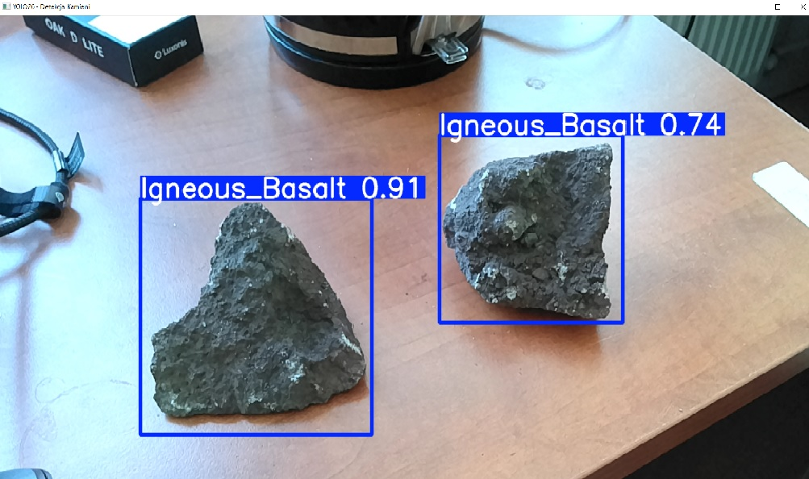
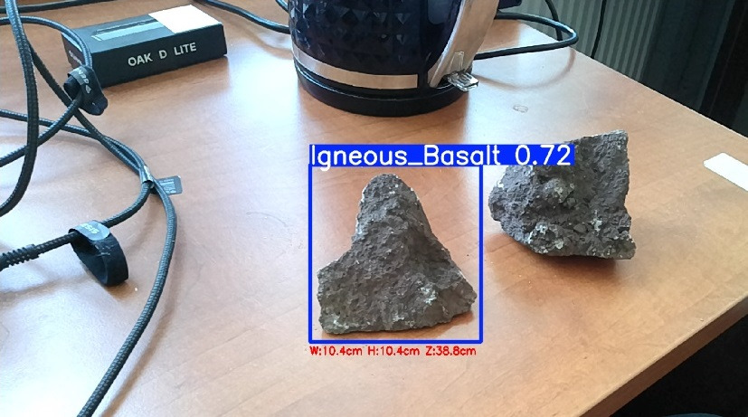

# "Ambition" Mars Rover Project

Welcome to the main repository for the **"Ambition" Mars Rover Project**. This repository contains a comprehensive pipeline for rock detection, ranging from classical computer vision algorithms to advanced deep learning models (YOLO, R-CNN). It houses the core software modules for autonomous navigation, terrain perception, and robotic system integration.

*Warning: The ROS system has currently been moved to the `feature_rocks_ros2` branch.*

> **Attention Team:** Please read the `cybair_pedia` repository thoroughly before you begin your work on this project!

  

---

## Repository Structure

The project is structured into specific directories to separate models, data, and test results:

* **`depthai_model/`**: Contains trained rock detection models that have been converted to the `.blob` format for native OAK camera support.
* **`lunar_Base/`**: An open-source database containing generated lunar terrain images (DM me for photos).
* **`poor_martian_Base/`**: An open-source database containing prepared images of Martian rocks (DM me for photos).
* **`results/`**: Stores images showcasing the current detection results.
* **`runs/`**: The location where trained rock detection models (specifically `.pt` files) are saved.
* **`test/`**: The testing database for model evaluation (DM me for photos).
* **`train/`**: The training database used to teach the models (DM me for photos).
* **`valid/`**: The validation database used during the model training process (DM me for photos).

---

## Project Files by Category

### YOLO & Deep Learning Training
* **`YOLOModel.py`**: Handles the training phase of a custom YOLO model (configures parameters, saves best weights, and validates on test images).
* **`YOLOModelPyTorch.ipynb`**: Jupyter notebook for training YOLOv8 using PyTorch with localized parameters (epochs=50, batch=8, workers=2).
* **`Model_Testing.ipynb`**: Comprehensive testing notebook containing CUDA verification, YOLOv8 confusion matrix validation, and dataset preparation utilities (PNG mask conversion to YOLO segmentation format and polygon-to-bbox bounding box conversion).

### Deployment & Live Inference
* **`YOLOEdges.py`**: Executes real-time YOLOv8 detection combined with OAK-D stereo vision to calculate the physical dimensions (width, height, and depth) of detected rocks in centimeters.
* **`BlobTestRun.py`**: Deploys the compiled `.blob` model directly on the DepthAI pipeline, calculating real-world object spatial coordinates (X, Y, Z in mm) via stereo depth alignment.
* **`ModelRunTest.py`**: Deploys a trained R-CNN model (VGG16 + Selective Search) on a live camera stream, utilizing a multi-threaded camera class to eliminate frame lag.

### Model Conversion Utilities
* **`Yolo2Blob.py`**: Exports trained YOLO weights to ONNX format and compiles them into a MyriadX `.blob` file using `blobconverter` for OAK-D deployment.

### Classical Vision & Mathematical Analysis
* **`Mathematic.py`**: Implements classical computer vision techniques based on the ROCKSTER algorithm. Features sky-ground variance segmentation, edge regrouping, endpoint gap filling, and flood-fill morphological operations to isolate rocks without neural networks.

### System Diagnostics & Utilities
* **`checkCUDA.py`**: Diagnostic script to verify hardware acceleration and GPU availability for both TensorFlow and PyTorch environments.
* **`CameraTest.py`**: A utility to check OAK-D camera connectivity, capture frames, handle a 180-degree rotation, and save images to disk for dataset expansion.

---

## Current Results

### Mathematical edge detection results

### Real-time object detection using YOLOv8

### Real-time object detection using YOLOv8 with dimensioning
